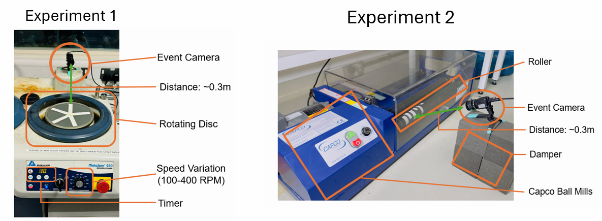

# Vibration Vision: Real-Time Machinery Fault Diagnosis with Event Cameras

## Overview

This repository contains the implementation of the Event-Based Frequency Mapping (EBFM) system described in the paper **"Vibration Vision: Real-Time Machinery Fault Diagnosis with Event Cameras"** by Muhammad Aitsam et al. The EBFM system leverages event cameras to detect machinery faults through real-time vibration monitoring. By utilizing the high temporal resolution of event cameras, our approach offers significant improvements in detecting and analyzing vibrational anomalies, making it suitable for dynamic industrial environments.

## Key Features

- **Event-Based Frequency Mapping (EBFM):** Converts event data into frequency maps, allowing for precise monitoring of vibrations in various lighting conditions.
- **Real-Time Fault Detection:** The system identifies and tracks dominant frequencies within user-defined regions of interest (ROIs) to detect anomalies.
- **Customizable GUI:** A graphical user interface (GUI) enables interactive monitoring and visualization of vibration frequencies in real-time.
- **Asynchronous Data Processing:** Utilizes event cameras for low-latency processing, making it ideal for environments requiring quick responses.

## Repository Structure

- **main.py:** The main entry point of the application. It initializes the GUI and processes the event stream to display the frequency map in real-time.
- **arg_parser.py:** Handles command-line arguments for the application, allowing users to specify input and output file paths.
- **gui_utils.py:** Contains the GUI implementation, which displays the vibration frequency maps and allows interaction with the data.
- **vibration_utils.py:** Implements the core functionalities of frequency map generation and dominant frequency calculation.

## Getting Started

### Prerequisites

- Python 3.7+
- OpenCV
- NumPy
- metavision_sdk_ui (for event camera interface)


### Usage

To run the vibration monitoring system, use the following command:

Clone the repository:

```bash
git clone https://github.com/yourusername/your-repo-name.git
cd your-repo-name
```

```bash
python main.py --input path/to/input --output path/to/output
```

- `--input`: Path to the input file (optional).
- `--output`: Path to save the output video (optional).

### Example

```bash
python main.py --output output_video.avi
```

This command will display the real-time vibration frequency map and save the visualization as a video file.

## Experimental Setup

The system has been tested on various industrial setups, demonstrating its ability to detect subtle vibrational anomalies under different operational conditions. For more details, refer to the **Experiment Setup and Evaluation** section in the paper.
Below is the setup used for the experiments discussed in the paper:



## Results

The EBFM system was able to effectively measure frequencies and detect unusual machine behavior in abnormal conditions. The difference between the calculated and measured frequencies was minimal, highlighting the system's precision.


CSV files of results are in the data folder.

## References

For further reading and citations, please refer to the original paper:

Aitsam, M., Goyal, G., Bartolozzi, C., & Di Nuovo, A. (2024). *Vibration Vision: Real-Time Machinery Fault Diagnosis with Event Cameras*. In *Proceedings of ECCV-NeVi Workshop*.

## License

This project is licensed under the MIT License.

## Acknowledgement

\section*{Acknowledgment}

This work is funded by Marie Sklodowska-Curie Action Horizon 2020 (Grant agreement No. 955778) for the project 'Personalized Robotics as Service Oriented Applications (PERSEO)'. The authors would like to thank lab members for their help and support. For open access, the author has applied a Creative Commons Attribution (CC BY) license to any Author Accepted Manuscript version arising from this submission.

## Contact

For questions or collaborations, please contact:

- Muhammad Aitsam: m.aitsam@shu.ac.uk
- Gaurvi Goyal
- Chiara Bartolozzi
- Alessandro Di Nuovo
